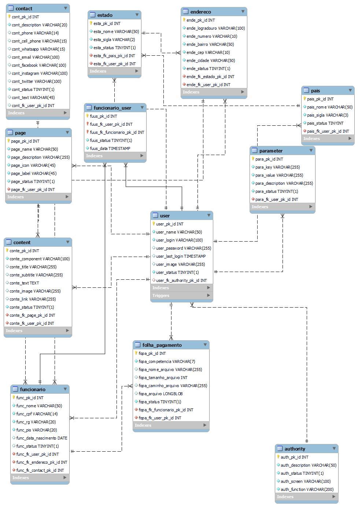
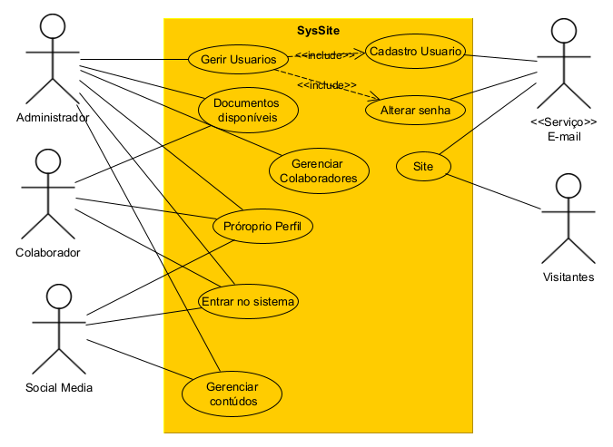

# Projeto Integrado - Engenharia de Software
Este repositório é utilizado para guardar e versionar o relatório técnico e demais documentos da disciplana Projeto Integrado do curso de engenharia de software.

### Pré-requisitos

Antes de começar, você vai precisar ter instalado em sua máquina as seguintes ferramentas:
[Microsoft Office](https://www.microsoft.com/pt-br/microsoft-365) ou [LibreOffice](https://www.libreoffice.org/)  e [Git](https://git-scm.com). 

## 🎲 Documentos Desenvolvidos

* **[Relatório Técnico](https://github.com/srgeverson/projeto-integrado/blob/main/RT_ProjetoIntegrado.docx)**

* **[Diragrama de Classe](https://github.com/srgeverson/projeto-integrado/blob/main/docs/SysSite_UML.png)**

* **[Diragrama de Entidade Relecionamento](https://github.com/srgeverson/projeto-integrado/blob/main/docs/SysSite_MER.png)**

* **[Diagrama de Caso de Uso](https://github.com/srgeverson/projeto-integrado/blob/main/docs/Diagrama_Caso_De_Uso.png)**

## 📃 Documentos Referênciados
* **Diagrama de Clsse - UML**

    

 alingn="center">
<iframe src="https://www.caelum.com.br/apostila/apostila-java-orientacao-objetos.pdf" width="600" height="780" style="border: none;"></iframe>

* **Diagrama de Entidade Relacionamento - MER**

    

* **Diagrama de Caso de Uso**

    

## 👨‍💻 Equipe de Desenvolvimento

* **Geverson Souza** - [LinkedIn](https://www.linkedin.com/in/srgeverson/)
## ✒️ Autor

* **Geverson Souza** - [LinkedIn](https://www.linkedin.com/in/srgeverson/)

## 📌 Versão 0.0.1

É utilizado [Github](https://github.com/) para controle de versão.
