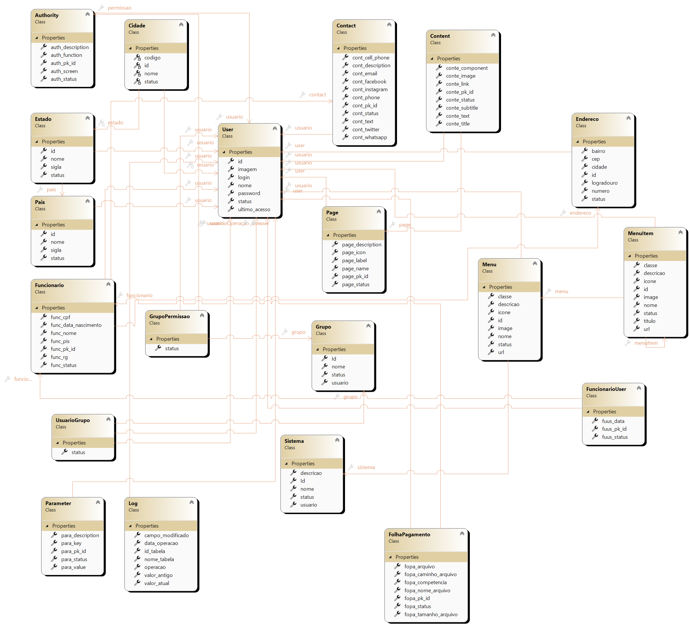
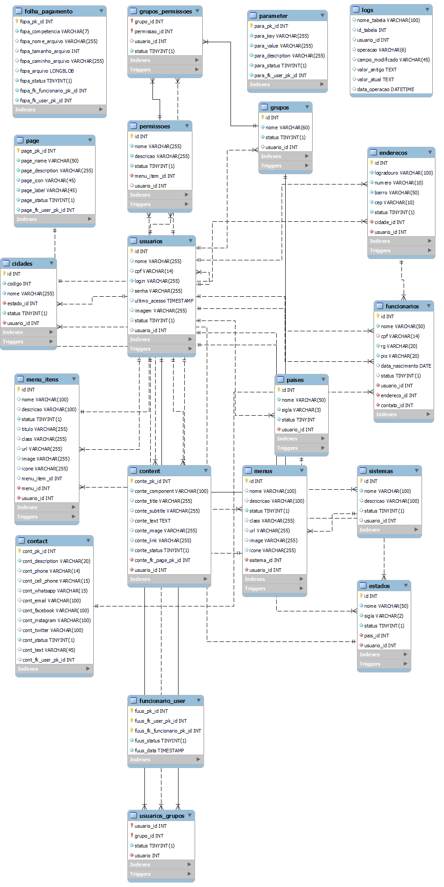

# Projeto Integrado - Engenharia de Software
Este repositório é utilizado para guardar e versionar o relatório técnico e demais documentos da disciplana Projeto Integrado do curso de engenharia de software.

### Pré-requisitos

Antes de começar, você vai precisar ter instalado em sua máquina as seguintes ferramentas:
[Microsoft Office](https://www.microsoft.com/pt-br/microsoft-365) ou [LibreOffice](https://www.libreoffice.org/)  e [Git](https://git-scm.com). 

## 🎲 Documentos Desenvolvidos

* **[Relatório Técnico](https://github.com/srgeverson/projeto-integrado/blob/main/RT_ProjetoIntegrado.docx)**

* **[Diagrama de Caso de Uso](https://github.com/srgeverson/projeto-integrado/blob/main/docs/Diagrama_Caso_De_Uso.png)**

* **[Prótotipo](https://www.figma.com/proto/22CAEZAgZxVe2JAAs3sbap/SysSite?node-id=13-69&scaling=contain&page-id=13%3A68&starting-point-node-id=13%3A69)**

* **[Diragrama de Classe](https://github.com/srgeverson/projeto-integrado/blob/main/docs/SysSite_UML.png)**

* **[Diragrama de Contexto](https://github.com/srgeverson/projeto-integrado/blob/main/docs/SysSite_Diagrama_De_Contexto.png)**

* **[Diragrama de Entidade Relecionamento](https://github.com/srgeverson/projeto-integrado/blob/main/docs/SysSite_MER.png)**

## 📃 Documentos Referênciados

* **Diagrama de Caso de Uso**

    

* **[Prótotipo](https://www.figma.com/proto/22CAEZAgZxVe2JAAs3sbap/SysSite?node-id=13-69&scaling=contain&page-id=13%3A68&starting-point-node-id=13%3A69)**

* **Diagrama de Clsse - UML**

    

* **Diagrama de Contexto**

    

* **Diagrama de Entidade Relacionamento - MER**

    

## 👨‍💻 Equipe de Desenvolvimento

* **Geverson Souza** - [LinkedIn](https://www.linkedin.com/in/srgeverson/)
## ✒️ Autor

* **Geverson Souza** - [LinkedIn](https://www.linkedin.com/in/srgeverson/)

## 📌 Versão 0.0.1

É utilizado [Github](https://github.com/) para controle de versão.
